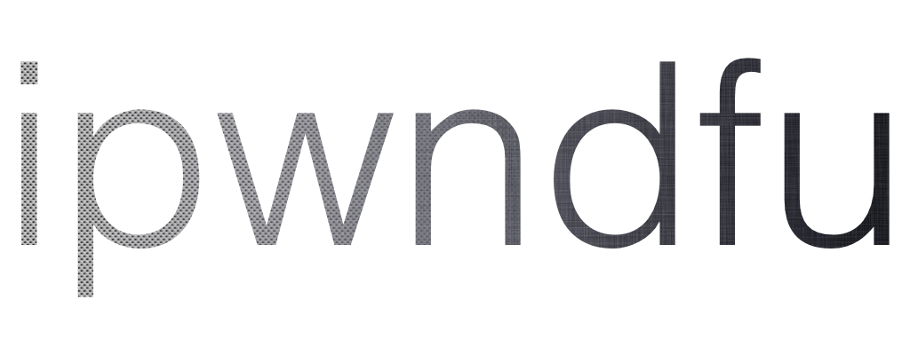

# Open-source jailbreaking tool for many iOS devices

# Cause there's no such thing as Good Silicon. Only Bad tests.

**Read [disclaimer](#disclaimer) before using this software.*

## About this fork

This fork is maintained by the hack-different team and is gladly accepting PRs from the wider community. All of the
original credit go to axi0mx et al.

## checkm8

* permanent unpatchable bootrom exploit for hundreds of millions of iOS devices

* meant for researchers, this is not a jailbreak with Cydia yet

* allows dumping SecureROM, decrypting keybags for iOS firmware, and demoting device for JTAG

* current SoC support: s5l8947x, s5l8950x, s5l8955x, s5l8960x, t7000, s8000, t8002, s8003, t8004, t8010, t8011, t8012,
  t8015

* future SoC support: s5l8940x, s5l8942x, s5l8945x, s5l8747x, t7001, s7002, s8001

* full jailbreak with Cydia on latest iOS version is possible, but requires additional work

## Dependencies

This tool should be compatible with Mac and Linux. It won't work in a virtual machine.

* poetry, `See https://python-poetry.org/docs/#installation`
* libusb, `If you are using Linux: install libusb using your package manager`
* libusbfinder (built with poetry)

## Building ipwndfu
* Run ``chmod +x dev_install.sh; ./dev_install.sh``

## Quick start guide for checkm8

1. Use a cable to connect device to your Mac. Hold buttons as needed to enter DFU Mode.

2. First run ```./main -p``` to exploit the device. Repeat the process if it fails, it is not reliable.

3. Run ```./main --dump-rom``` to get a dump of SecureROM.

4. Run ```./main --decrypt-gid KEYBAG``` to decrypt a keybag.

5. Run ```./main --demote``` to demote device and enable JTAG.

## About this fork (addendum)

This fork supports the t8012 chip. It is based on
[LinusHenze's ipwndfu patches](https://github.com/LinusHenze/ipwndfu_public), which allow it to boot iBoot without
destroying the heap. A simple patch that allows you to boot any extracted iBoot image (without the img4 wrapper) is
provided in `nop_image4.py`, which was based on LinusHenze's `rmsigchks.py`.

## Features

* Jailbreak and downgrade iPhone 3GS (new bootrom) with alloc8 untethered bootrom exploit. :-)

* Pwned DFU Mode with steaks4uce exploit for S5L8720 devices.

* Pwned DFU Mode with limera1n exploit for S5L8920/S5L8922 devices.

* Pwned DFU Mode with SHAtter exploit for S5L8930 devices.

* Dump SecureROM on S5L8920/S5L8922/S5L8930 devices.

* Dump NOR on S5L8920 devices.

* Flash NOR on S5L8920 devices.

* Encrypt or decrypt hex data on a connected device in pwned DFU Mode using its GID or UID key.

## Disclaimer

**This is BETA software.**

Backup your data.

This tool is currently in beta and could potentially brick your device. It will attempt to save a copy of data in NOR to
nor-backups folder before flashing new data to NOR, and it will attempt to not overwrite critical data in NOR which your
device requires to function. If something goes wrong, hopefully you will be able to restore to latest IPSW in iTunes and
bring your device back to life, or use nor-backups to restore NOR to the original state, but I cannot provide any
guarantees.

**There is NO warranty provided.**

THERE IS NO WARRANTY FOR THE PROGRAM, TO THE EXTENT PERMITTED BY APPLICABLE LAW. THE ENTIRE RISK AS TO THE QUALITY AND
PERFORMANCE OF THE PROGRAM IS WITH YOU. SHOULD THE PROGRAM PROVE DEFECTIVE, YOU ASSUME THE COST OF ALL NECESSARY
SERVICING, REPAIR OR CORRECTION.

## Credit

geohot for limera1n exploit

posixninja and pod2g for SHAtter exploit

chronic, CPICH, ius, MuscleNerd, Planetbeing, pod2g, posixninja, et al. for 24Kpwn exploit

pod2g for steaks4uce exploit

walac for pyusb

checkra1n team, littlelailo for the idea of just removing the call to image4_load

linushenze for ipwndfu patches

hack-different team, for actively maintaining & updating ipwndfu

dora2-iOS for s8001 (A9X) support

t2-development-team for t8012 support
